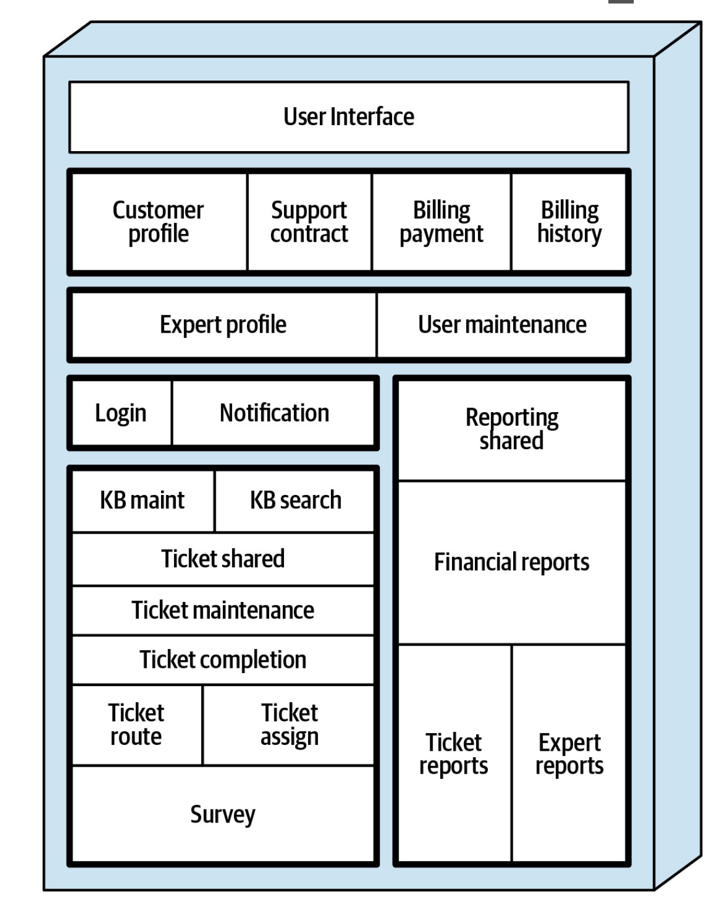
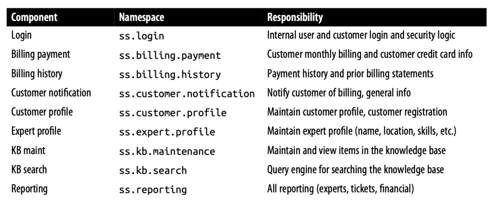
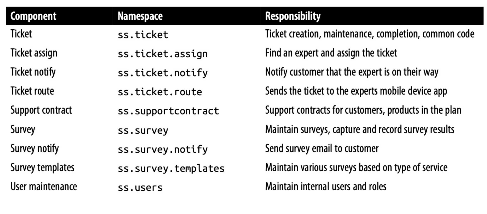
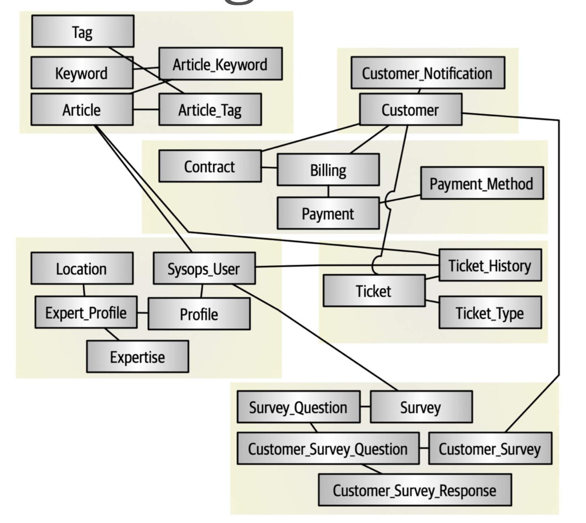
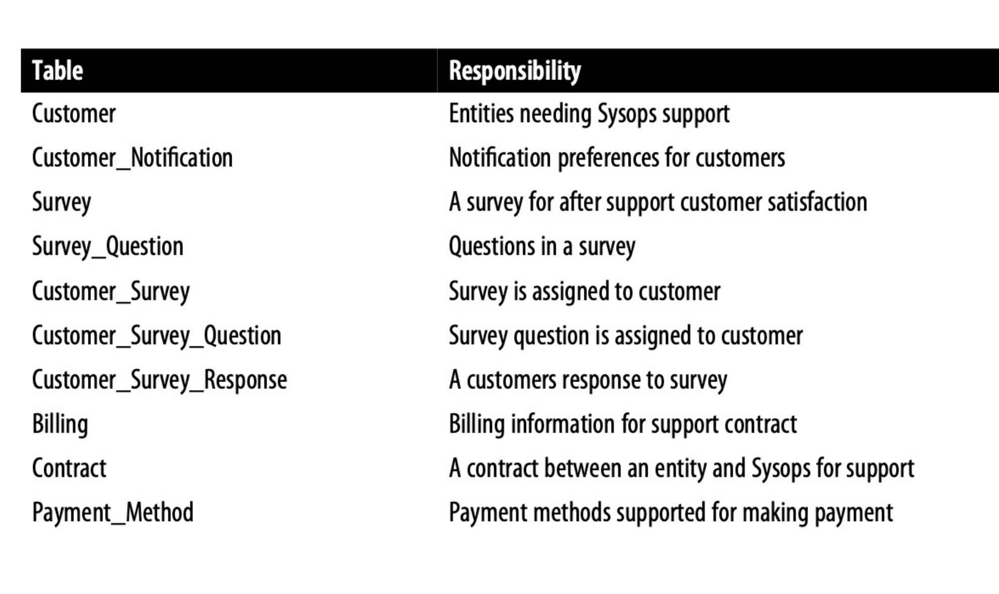
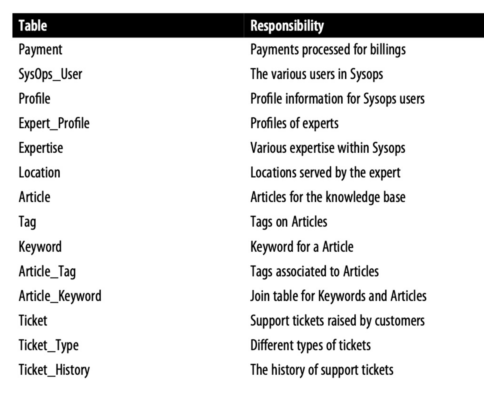

# System Overview

## Architecture Components

### Responsabilities

### Discussion

The current system clearly implements a monolith style of architecture. Also, it is interesting to note that the architecture is not actually partitioned in technical layers but rather in domain. Even though monolithic architecture probably helped in getting the system where it is now, it seems at a stage where there is a need for greater decomposition and complexity outweigh the easiness of building, testing or deploying a monolith system. It seems clear that some problems mentioned such as the coupling of components making it hard to change, or the performance issue are due to the monolithic nature of the system.

## Database Tables

### Responsabilities

### Discussion

The database architecture does not really share the decomposition of the existing components. Many dependencies emerge which might make the splitting if needed difficult. Also, from a security point view, it might be dangerous to mix payments with other application tables responsibilities. This would need better partitioning although it might be challenging.
